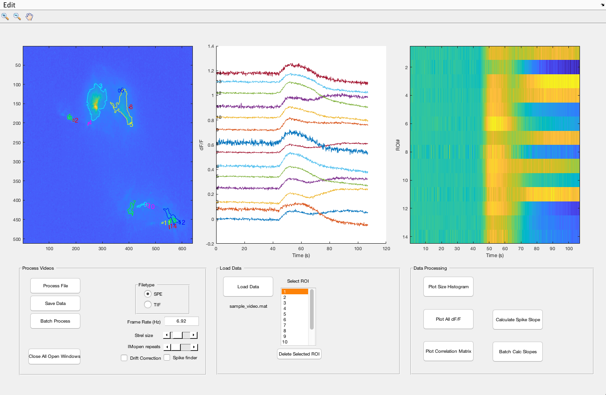

# Nanosensor-Brain-Imaging
Nanosensor-Brain-Imaging is a suite of MATLAB code designed specifically for processing brain tissue imaging data and quantifying the fluorescent response of infrared fluorescent nanosensors.

## File List:

New for version 0.2!

`nanosensor_imaging_GUI.m` - Introduces a convenient GUI frontend for processing single files, batch processing folders, loading processed datasets (`*.mat` files) and plotting single ROI traces by clicking on the image.

Detailed README updates coming soon!

---

---

`SpeReader.m` - Helper function for importing Princeton Instruments '.spe' image stacks. Obtained from the Mathworks File Exchange (see Legal below)

---

`git.m` - Wrapper for using git within MATLAB console. Obtained from the Mathworks File Exchange

---
## Legal
`SpeReader.m`

Copyright (c) 2013, W. Jansen 
All rights reserved.

Redistribution and use in source and binary forms, with or without 
modification, are permitted provided that the following conditions are 
met:

* Redistributions of source code must retain the above copyright 
notice, this list of conditions and the following disclaimer. 
* Redistributions in binary form must reproduce the above copyright 
notice, this list of conditions and the following disclaimer in 
the documentation and/or other materials provided with the distribution

THIS SOFTWARE IS PROVIDED BY THE COPYRIGHT HOLDERS AND CONTRIBUTORS "AS IS" 
AND ANY EXPRESS OR IMPLIED WARRANTIES, INCLUDING, BUT NOT LIMITED TO, THE 
IMPLIED WARRANTIES OF MERCHANTABILITY AND FITNESS FOR A PARTICULAR PURPOSE 
ARE DISCLAIMED. IN NO EVENT SHALL THE COPYRIGHT OWNER OR CONTRIBUTORS BE 
LIABLE FOR ANY DIRECT, INDIRECT, INCIDENTAL, SPECIAL, EXEMPLARY, OR 
CONSEQUENTIAL DAMAGES (INCLUDING, BUT NOT LIMITED TO, PROCUREMENT OF 
SUBSTITUTE GOODS OR SERVICES; LOSS OF USE, DATA, OR PROFITS; OR BUSINESS 
INTERRUPTION) HOWEVER CAUSED AND ON ANY THEORY OF LIABILITY, WHETHER IN 
CONTRACT, STRICT LIABILITY, OR TORT (INCLUDING NEGLIGENCE OR OTHERWISE) 
ARISING IN ANY WAY OUT OF THE USE OF THIS SOFTWARE, EVEN IF ADVISED OF THE 
POSSIBILITY OF SUCH DAMAGE.

`git.m`

The MIT License (MIT)
Copyright (c) 2013 Manu Raghavan

Permission is hereby granted, free of charge, to any person obtaining a copy
of this software and associated documentation files (the "Software"), to deal
in the Software without restriction, including without limitation the rights
to use, copy, modify, merge, publish, distribute, sublicense, and/or sell
copies of the Software, and to permit persons to whom the Software is
furnished to do so, subject to the following conditions:

The above copyright notice and this permission notice shall be included in
all copies or substantial portions of the Software.

THE SOFTWARE IS PROVIDED "AS IS", WITHOUT WARRANTY OF ANY KIND, EXPRESS OR
IMPLIED, INCLUDING BUT NOT LIMITED TO THE WARRANTIES OF MERCHANTABILITY,
FITNESS FOR A PARTICULAR PURPOSE AND NONINFRINGEMENT. IN NO EVENT SHALL THE
AUTHORS OR COPYRIGHT HOLDERS BE LIABLE FOR ANY CLAIM, DAMAGES OR OTHER
LIABILITY, WHETHER IN AN ACTION OF CONTRACT, TORT OR OTHERWISE, ARISING FROM,
OUT OF OR IN CONNECTION WITH THE SOFTWARE OR THE USE OR OTHER DEALINGS IN
THE SOFTWARE.

`notBoxPlot.m`

raacampbell/notBoxPlot is licensed under the GNU General Public License v2.0
The GNU GPL is the most widely used free software license and has a strong copyleft requirement. When distributing derived works, the source code of the work must be made available under the same license. There are multiple variants of the GNU GPL, each with different requirements.
